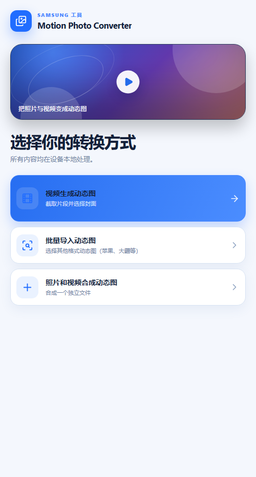
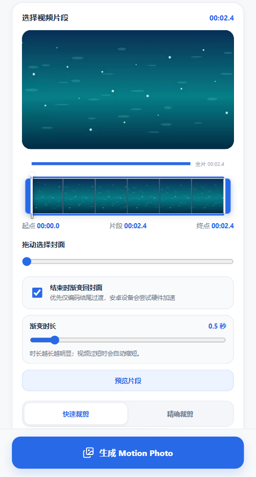

# Samsung Motion Photo Converter

一个面向三星 Motion Photo 的本地转换工具，提供 Web 预览版和 Android WebView 封装版。

项目使用 React + Vite 实现界面和媒体处理逻辑，Android 端通过 WebView 离线加载 Web 资源。所有媒体处理均在本机完成，不上传用户文件。

[在线预览](https://xanhiaoo.github.io/samsung-motion-photo-converter/) · [GitHub Actions](https://github.com/XanHiaoo/samsung-motion-photo-converter/actions)

## 功能

- 从视频生成 Samsung Motion Photo，并选择封面帧。
- 批量导入和转换动态图片。
- 合成照片与视频，并支持图片自适应视频尺寸。
- 支持 JPEG、HEIC、MOV 等常见输入。
- 在本机完成媒体处理，并将 Android 生成结果保存到相册。

## 界面预览

<div align="center">
  
  
  <p><sub>首页与视频生成界面</sub></p>
</div>

## 技术栈

- Web：React、TypeScript、Vite
- 媒体处理：Web Worker、WebAssembly、FFmpeg
- Android：Java、WebView、WebViewAssetLoader
- 构建与发布：Gradle、GitHub Actions、GitHub Pages

## 快速开始

### Web 开发预览

Windows PowerShell：

```powershell
cd web
npm.cmd ci
npm.cmd run dev -- --host 127.0.0.1 --strictPort
```

Linux/macOS：

```bash
cd web
npm ci
npm run dev -- --host 127.0.0.1 --strictPort
```

访问 <http://127.0.0.1:5173/samsung-motion-photo-converter/>。

也可以在 VS Code 中使用 Run and Debug，或执行 `Tasks: Run Task` → `web:dev`。

### Android APK

Android 构建前需要先生成 Web 资源：

```text
npm run build:android
```

Debug 和 Release 的完整构建方式、VS Code 任务及环境配置见：[开发指南](docs/DEVELOPMENT.md)。

## 构建类型

| 类型 | 用途 | 输出或发布方式 |
| --- | --- | --- |
| Web Development | 本地开发和热更新 | `npm run dev` |
| Web Production | Web 发布预览 | `npm run build` → `npm run preview` |
| Android Debug | 本地安装和测试 | `app/build/outputs/apk/debug/app-debug.apk` |
| Android Release | 正式分发 | `app/build/outputs/apk/release/app-release.apk` |
| GitHub Release | Tag 自动发布 | 推送 `v*.*.*` tag |

Release 签名、GitHub Secrets 和 Tag 发布流程见：[发布指南](docs/RELEASE.md)。

## 目录

```text
app/                  Android WebView 壳和打包后的 Web 资源
web/                  Web 源码、媒体处理逻辑和测试
docs/                 用户指南、开发指南和发布指南
.github/workflows/    Pages 部署和 APK 发布工作流
.vscode/              VS Code 任务与调试配置
```

修改 Web 源码后不要直接编辑 `app/src/main/assets/`，应重新执行 `npm run build:android` 生成资源。

## 文档

- [用户使用指南](docs/USER_GUIDE.md)
- [用户使用手册 PDF](docs/motion-photo-converter-user-guide.pdf)
- [开发指南](docs/DEVELOPMENT.md)
- [发布指南](docs/RELEASE.md)

## 在线部署

推送到 `main` 会触发 GitHub Pages 部署；推送版本 tag 会触发 Release APK 构建。具体工作流位于 `.github/workflows/`。
