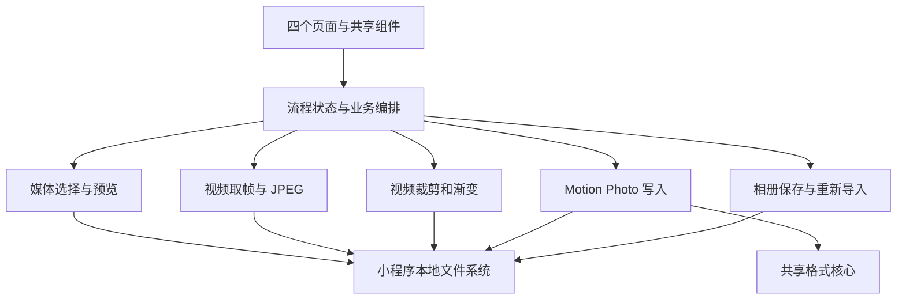

# 微信小程序开发方案

基准版本：`1f01fdfd6ba4c4abae745229808969d7cb1ce7da`（2026-09-23）。工作分支：`feature/wechat-miniprogram`。

## 已确定的目标

- 在当前仓库新增可独立打开、构建和运行的 `miniprogram/` 项目。直接开发正式小程序，不另建临时验证程序。
- 首个交付闭环为：导入一段视频，选取视频中的一帧作为封面，生成 Samsung Motion Photo，保存到相册，再重新导入检查。
- 所有媒体处理在设备本机完成，不上传原始文件。
- 正式小程序覆盖现有首页、视频生成、批量转换、照片加视频三种入口及其操作状态。应用绘制的界面以当前运行的 Android App 为视觉基准，保持文案、图标、颜色、布局、尺寸、状态和交互一致。

微信自带的右上角菜单胶囊、系统状态栏、权限弹窗和媒体选择器由微信与系统绘制，无法改变成 Android App 的像素。应用内容区使用自定义导航栏，并在可用区域内还原当前界面。

取帧、相册保存等关键能力在正式工程的开发过程中验证。诊断信息写入开发记录，不增加用户可见的“验证模式”或第二套应用。

## 当前实现与视觉基准

现有 Android 版由 `app/` 中的 WebView 加载 `web/` 构建产物。当前页面结构在 `web/src/App.tsx`，样式在 `web/src/styles.css`，格式分析与封装在 `web/src/core/`。`docs/images/` 中的截图是旧版本，不能作为小程序的视觉基准。

已从当前 APK 实际运行界面确认：

- 首页：左上方图标与 Motion Photo Tool 品牌、较大标题“动态图工具”、一张蓝色“视频生成动态图”主卡片、两张并排的白色入口卡片，以及底部的本机处理提示。
- 视频初始页：返回按钮与标题、本机处理提示、说明文字、虚线“选择一个视频”区域，以及固定在底部的生成按钮。

已保存第一批运行截图：[首页](miniprogram-baseline/android-emulator-home-1080x2400.png)、[视频空态](miniprogram-baseline/android-emulator-video-empty-1080x2400.png)。采集环境为 Android API 36 模拟器、1080 × 2400 像素、420 dpi，安装的是当前仓库的 Debug APK。这两张图用于布局基准；媒体兼容性仍须在目标真机验证。

M0 补充采集记录、样式值和待覆盖状态见 [M0 当前运行基准](miniprogram-baseline/M0-CURRENT-RUN.md)，其中追加了首页、视频已选/处理中、批量页、照片加视频页和系统视频选择器截图。

开发开始时要采集当前 App 的完整基准图，并记录设备像素尺寸、密度、系统字体大小、系统栏高度和基准提交。至少覆盖：

1. 首页；视频页的空、已选视频、已选封面、处理中、成功和错误状态。
2. 批量转换页的空、文件列表、处理中、成功和错误状态。
3. 照片加视频页的空、已选媒体、处理中、成功和错误状态。
4. 窄屏、常见屏宽、较大屏宽，以及 Android 和 iPhone 真机上的安全区域。

从运行界面和最终生效的样式提取颜色、字号、间距、圆角、阴影与图标。`styles.css` 有多组后置覆盖规则，不能只照抄文件开头的变量。图标沿用同一份源素材并生成小程序可用资源。

## 第一阶段：完成视频生成基础链路

直接在正式小程序中实现当前首页与视频页的视觉结构，并完成核心媒体链路。首个输入使用设备能够直接播放的 H.264 MP4，视频主体保持原样，封面从用户选择的时间点取得。

| 步骤 | 实现工作 | 必须得到的结果 |
| --- | --- | --- |
| 项目启动 | 建立 `miniprogram/`、构建配置和独立的微信开发者工具项目 | 可进入与当前 App 对应的首页和视频页 |
| 导入 | 从相册选择原始视频，取得本地路径、文件大小、时长和画面尺寸 | 可播放，读到的文件字节确实包含 MP4 数据 |
| 选帧 | 显示视频与当前样式的选择控件；定位到指定时间，取得解码帧并输出 JPEG | 预览的封面与输出封面是同一画面；记录实际帧时间与目标时间的偏差 |
| 合成 | 调用现有 `muxSamsungMotionPhoto` 格式逻辑，写出 `_MP.jpg` | 输出通过现有 `analyzeBytes` 和 Samsung 兼容性校验 |
| 保存 | 将结果作为本地图片文件交给相册保存接口 | 重新从相册导入后，XMP、MP4 和 SEF 尾部仍完整 |
| 真机确认 | 在 Android 微信和 iPhone 微信分别走完整流程 | 三星设备相册能识别并播放动态照片；处理过程不崩溃 |

取帧拟使用小程序的视频解码器，预览用视频组件；帧时间、像素格式、JPEG 编码以及 iOS/Android 行为要以真机结果为准。相册保存接口是否原样保留 JPEG 尾部附加的视频数据也是发布前的硬性验证项。

**完成标准：**用户可以从视频选择指定封面帧，得到通过结构校验的 `_MP.jpg`；保存后重新导入仍保留内嵌 MP4，且目标三星相册能播放。记录视频时长、尺寸、文件大小、峰值内存和处理时间，形成第一组兼容性边界。

若取帧或相册保存不满足完成标准，应先解决该环节，再扩展其他功能。真机型号、微信版本、样本文件信息和处理结果写入开发记录。

## 第二阶段：补齐完整功能

### 1. 视频生成动态照片

完整还原当前视频页：时间轴的六帧缩略图、片段起止拖动、封面时间滑块、播放预览、快速/精确裁剪、结尾渐变、进度与结果状态。`web/src/lib/video-trim.ts` 中的时间规则和文案是行为基准。基础链路通过后，再验证视频处理引擎的本机可行性。

现有 FFmpeg WASM 原文件约 32.2 MB，浏览器版加载器还依赖 Web Worker 与 Blob URL。应分别验证小程序代码包、WASM 加载、快速裁剪、精确 H.264 编码、渐变、内存和处理耗时。引擎选型在验证结果明确后确定；不能只证明 WASM 可加载就认为全部视频功能可用。

### 2. 照片加视频

还原照片与视频选择区、图片自适应选项、片段选择、进度与结果。JPEG 可直接进入封装；PNG/HEIC 转 JPEG、MOV 转 MP4 的实现分别验证，保留现有错误提示和结果校验。

### 3. 批量转换

还原导入区、任务列表、每项状态、总进度和保存按钮。逐个处理已有动态图片，验证输入选取是否保留原始 Motion Photo 字节，处理过程中清理临时文件和内存。

### 4. 发布准备

完成包体积、真机性能、权限说明、异常处理和三条流程的回归。所有现有可见交互和状态都实现后再认定功能完成。

## 目标架构

```text
web/                         现有 React + Vite 客户端
app/                         现有 Android WebView 客户端
packages/motion-core/        两端共用的纯 TypeScript 格式解析、封装与校验
miniprogram/
  src/app.*                  小程序入口和全局样式变量
  src/pages/                 home、video、embedded、manual 四个页面
  src/components/            标题栏、隐私提示、导入区、时间轴、进度卡、结果卡等
  src/features/              各流程的状态管理和业务编排
  src/platform/              微信媒体选择、视频取帧、文件系统、相册保存
  src/media/                 视频处理策略、Motion Photo 文件写入
  src/workers/               重计算任务的单一入口
  src/assets/                由当前图标源文件生成的资源
  project.config.json        微信开发者工具项目配置
```



`packages/motion-core` 只接收字节、数值和普通数据结构，不依赖 DOM、`File`、`Blob`、`window` 或 `wx`。现有 `web/src/core` 的 JPEG、MP4、XMP、Samsung 尾部解析和封装可迁入；依赖浏览器 `File` 的配对逻辑留在客户端适配层。首个视频流程可通过构建脚本引用当前核心源码，后续再抽出共享包，避免手工复制两份实现。

`platform/` 隔离微信 API；`features/` 管理页面状态和业务顺序。视频页状态至少包含 `idle`、`analyzing`、`ready`、`working`、`success`、`error`，并保存视频路径、时长、片段起止、封面时间、裁剪模式和渐变选项。页面不直接处理文件字节。

首个视频流程可先用小文件复用现有 `Uint8Array` 封装函数。后续需测量多次完整拷贝的峰值内存；若容量不足，`media/` 中改为按块写入 JPEG、视频及 SEF 尾部，而格式参数仍由共享核心计算。

## 界面一致性验收

- 页面结构、中文文案、入口顺序、图标、颜色、字号、间距、圆角、阴影、背景、底部按钮及禁用/加载/成功/错误状态与运行中的 Android App 对照。
- 以相同内容宽度和字体设置采集对照图；先逐项校正位置、尺寸和换行，再比较颜色、图标与细节。较窄和较宽的设备都要检查。
- 小程序使用自定义导航栏，计算状态栏和微信胶囊占位。应用内容区按现有页面布局实现；微信自带控件保留其系统外观。
- 视频页使用应用自己的播放、时间轴和封面选择控件，使可见交互与当前页面一致。系统视频组件的默认控制条不能改变当前页面布局。
- 不以 `docs/images/` 中的旧图验收。每轮界面改动都与本方案开始时采集的实际 App 画面对照。

## 工作顺序与交付物

| 里程碑 | 交付物 | 完成条件 |
| --- | --- | --- |
| M0 运行基准 | 当前 App 各页面和状态的截图、尺寸记录、样式清单 | 基准图来自实际运行版本，覆盖主要状态 |
| M1 项目骨架 | 独立小程序、首页和视频页基础组件 | 微信开发者工具可运行，首页与视频空态完成视觉对照 |
| M2 视频取帧 | 导入、预览、选帧、JPEG 文件 | 所选时间与输出封面一致，Android/iOS 真机可运行 |
| M3 生成和保存 | 共享格式核心接入、写文件、结构校验、相册回读 | 三星相册可播放保存结果 |
| M4 完整视频模式 | 时间轴、裁剪、渐变、进度和所有状态 | 功能与界面都和当前视频模式一致 |
| M5 其他两种模式 | 照片加视频、批量转换及格式适配 | 三个入口和状态全部完成 |
| M6 发布检查 | 包体、权限、兼容性、视觉对照和回归记录 | 目标设备上完整运行，可提交审核 |

M1–M3 是正式小程序的首个交付闭环，直接在同一工程中继续开发 M4–M6。每个里程碑保留可运行版本和清晰的开发记录。

## 平台接口核验清单

实施前以目标微信基础库和真机行为复核：[媒体选择](https://developers.weixin.qq.com/miniprogram/dev/api/media/video/wx.chooseMedia.html)、[视频解码器](https://developers.weixin.qq.com/miniprogram/dev/api/media/video-decoder/wx.createVideoDecoder.html)、[文件系统](https://developers.weixin.qq.com/miniprogram/dev/api/file/wx.getFileSystemManager.html)、[保存到相册](https://developers.weixin.qq.com/miniprogram/dev/api/media/image/wx.saveImageToPhotosAlbum.html)、[Worker](https://developers.weixin.qq.com/miniprogram/dev/api/worker/wx.createWorker.html)、[WXWebAssembly](https://developers.weixin.qq.com/miniprogram/dev/framework/performance/wasm.html)和[分包](https://developers.weixin.qq.com/miniprogram/dev/framework/subpackages.html)。
